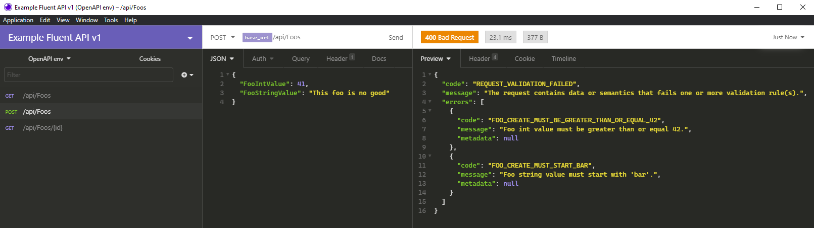

# Example.Api.Fluent

This repository contains a working example of using the Denali library along with [FluentValidation](https://fluentvalidation.net/) to perform request validation during model binding.

This project uses the following libraries

* [ASP.Net Core (v2.1)](https://docs.microsoft.com/en-us/aspnet/core/release-notes/aspnetcore-2.1?view=aspnetcore-5.0)
* [Denali (v0.7.0)](https://dev.azure.com/plexdev/PlexSystems/_git/Denali)
* [FluentValidation.AspNetCore (v9.5.1)](https://fluentvalidation.net/)
* [Swashbuckle.AspeNetCore (v6.0.7)](https://github.com/domaindrivendev/Swashbuckle.WebApi)
* [MicroElements.Swashbuckle.FluentValidation (v.6.0.7)](https://github.com/micro-elements/MicroElements.Swashbuckle.FluentValidation)

Note: ASP Net Core 2.1 is still used to maintain compatibility with the Denali Library.

## Why Use This Approach

There are a number of advantages for using this pattern that I can see.

### Validation Is Testable

Using FluentValidation along with XUnit, fluent validators are testable with unit tests.  Abstract validators support dependency injection of services which allow you to build complex buisness rule validations in a manner that is readable.

Example:

Imagine we have a buisness rule that all `Foo` records created need to have an integer value supplied that is greather than or equal to `42`.  In this validator we're validating that our value is greater than `42`, and setting the error message to a Denali style error code.

```cs
public class FooCreateRequestValidator : AbstractValidator<FooCreateRequest>
{
    public FooCreateRequestValidator()
    {
        this.RuleFor(x => x.FooIntValue)
            .GreaterThanOrEqualTo(42)
            .WithMessage(FooErrors.FooIntValueMustBeGreaterThanOrEqual42);
    }
}
```

We can now write a unit test to validate our rule completely independent of our controller.

```cs
[Fact]
public void ShouldHaveErrorWhenIntLessThan42()
{
    var request = new FooCreateRequest
    {
        FooIntValue = 41
    };

    var result = _validator.TestValidate(request);
    result.ShouldHaveValidationErrorFor(x => x.FooIntValue);
}
```

### Validation Happens During Model Binding

Validation logic tends to be very "leaky" and you end up calling the same methods over and over again to validate the same set of rules.

By moving buisness rule validation in to the model binding phase request, your controller logic can become a lot simpler.  You know that any invalid request would have been rejected ahead of time.

Our create `Foo` controller method is now short and simple:

```cs
[HttpPost]
[ProducesResponseType(StatusCodes.Status201Created)]
[ProducesResponseType(typeof(ValidationResponse), StatusCodes.Status400BadRequest)]
public IActionResult Create([FromBody] FooCreateRequest request)
{
    var foo = new Foo
    {
        FooId = Guid.NewGuid(),
        FooCreateDateTimeOffset = DateTimeOffset.UtcNow,
        FooIntValue = request.FooIntValue,
        FooStringValue = request.FooStringValue
    };
    
    FooRepository.AllFoos.Add(foo.FooId, foo);

    return this.CreatedAtAction(nameof(this.GetById), new {id = foo.FooId}, foo);
}
```

Our create controller method is now only concerned with the creation of `Foo` objects and saving them.  Any invalid `Foo` creation request would have been rejected.  If the required value of `42` should ever change in the future, our controller logic will never need to be touched.

### FluentValidation Returns All Known Problems At One Time

There is nothing more annoying than sending a request to an API, getting an error about a particular property, fixing it, only to get another error about the next problem.  This frequently happens in validation patterns which error out at the first sign of trouble.

FluentValidation can return an array of issues allowing your consumer to know that there are multiple issues with their request that need to be fixed before trying again.



## Implementation

The implementation is fairly straight forward.  First we create an `IActionFilter` which checks our models state, and updates our context response with a Denali `ValidationResponse`.

```cs
public void OnActionExecuting(ActionExecutingContext context)
{
    if (context.ModelState.IsValid)
    {
        return;
    }

    // Convert FluentValidation messages to Denali style responses
    var response = new ValidationResponse();
    var errors = context.ModelState.SelectMany(x => x.Value.Errors)
        .Select(x => new Error(x.ErrorMessage)).ToList();

    foreach (var error in errors)
    {
        // null on the metadata for now...in the future pass in more info?
        response.AddError(error.Code, null);
    }

    context.Result = response.ToResult();
}
```

If each of your FluentValidation rules has a message that is the Denali error code, this builds our `ValidationResponse` and sets it as the context result message.

In our `Startup.cs` we need to just wire in a few things and we are done.

```cs
services
    .AddMVC(opt => opt.Filters.Add(typeof(FluentValidatorActionFilter)))
    .AddFluentValidation(fv => {
        fv.RegisterValidatorsFromAssembly(Assembly.GetExecutingAssembly());
    });
```

In this example project I've included the MicroElements FluentValidation Swagger helper library which does it's best to parse through your validation classes and apply it to the Open API spec.  This is really useful if you are using the resulting OpenAPI spec to do client generation.

